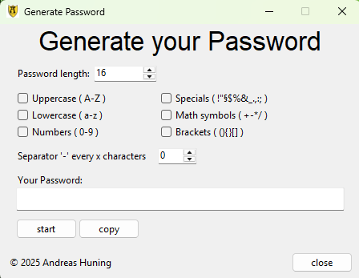

# 🔐 Passwort Generator (GUI)

Ein einfaches, benutzerfreundliches Tool zur Erstellung sicherer Passwörter – entwickelt mit **Python** und **Tkinter**.



---

## 📖 Inhaltsverzeichnis

- [Funktionen](#funktionen)
- [Schnellstart](#schnellstart)
- [Bedienung](#bedienung)
- [Dateistruktur](#dateistruktur)
- [Sicherheitshinweis](#sicherheitshinweis)
- [Autor](#autor)
- [Lizenz](#lizenz)

---

## ✨ Funktionen

✅ Benutzerdefinierte Passwortlänge  
✅ Auswahl verschiedener Zeichentypen:
- 🔠 Großbuchstaben (A–Z)
- 🔡 Kleinbuchstaben (a–z)
- 🔢 Zahlen (0–9)
- 🔣 Sonderzeichen (!"§$%&_.,:;)
- ➕ Mathematische Zeichen (+ - * /)
- 🧮 Klammern ((){}[])  
✅ Automatisches Kopieren in die Zwischenablage  
✅ Trennzeichen (z. B. für Seriennummern)  
✅ Kompakte und intuitive Oberfläche mit **Tkinter**

---

## 🚀 Schnellstart

### 🔧 Voraussetzungen

- Python **3.8 oder höher**
- Keine externen Bibliotheken notwendig (nur Python-Standardbibliothek)

### ▶️ Anwendung starten

```bash
python main.py
```

Oder, wenn mit **PyInstaller** kompiliert:

```bash
./main.exe
```

---

## 💡 Bedienung

1. Wähle die gewünschte **Passwortlänge**
2. Aktiviere mindestens **einen Zeichentyp**
3. (Optional) Gib an, nach wie vielen Zeichen ein Trennzeichen `-` eingefügt werden soll
4. Klicke auf **Start**, um das Passwort zu generieren
5. Mit **Copy** kopierst du das Passwort in die Zwischenablage
6. Mit **Close** beendest du das Programm

---

## 📁 Dateistruktur

```plaintext
passwort_generator/
├── assets/
│   ├── favicon.ico        # Fenster-Icon
│   └── preview.png        # Vorschau des Programms
├── main.py  # Hauptskript
└── README.md              # Diese Datei
```

---

## 🔒 Sicherheitshinweis

Dieses Tool generiert Passwörter **lokal auf deinem Gerät**. Es speichert, überträgt oder protokolliert **keine Daten**. Dennoch empfiehlt es sich, Passwörter regelmäßig zu ändern und sicherheitskritische Systeme mit zusätzlicher Absicherung (z. B. Zwei-Faktor-Authentifizierung) zu schützen.

---

## 👤 Autor

**Andreas Huning**  
🔗 [GitHub: Andreas-Huning](https://github.com/Andreas-Huning)

---

## 🧊 Lizenz

Veröffentlicht unter der **MIT-Lizenz**. Siehe [LICENSE](LICENSE) für Details.
